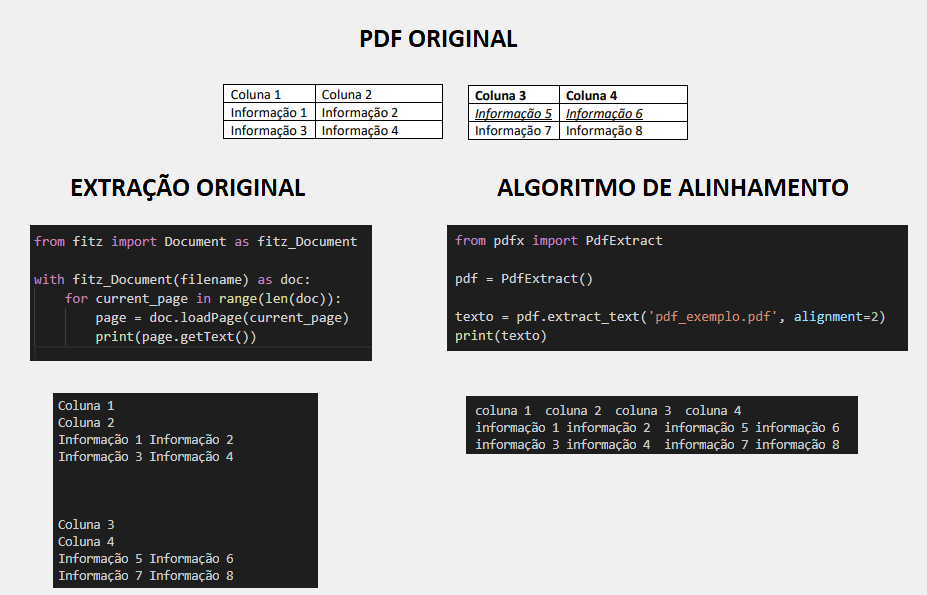
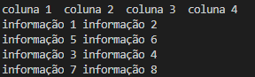
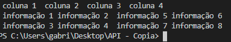

# PDFX



Este repositório é uma extensão da biblioteca fitz do pymupdf. O objetivo dele é fornecer uma implementação de um algoritmo para alinhar dados extraídos a partir de documentos PDF.

Conforme o exemplo na imagem acima, muitos arquivos PDF podem vir com conteúdo desalinhados, fazendo alguns extratores de PDF posicionar esses dois textos em posições distintas, dificultando a análise dos dados. Através dessa implementação, você consegue definir uma tolerância (alignment) para o algoritmo posicionar itens na mesma linha caso eles estejam dentro desta tolerância.

A implementação simples, se dá através destes passos:   

1. Instale o PyMuPDF, este algoritmo se baseia nos dados extraídos por esta biblioteca.  
```python
pip install PyMuPDF==1.18.5
```

2. Baixe esse repositório na pasta do seu projeto  
3. importe o arquivo "pdfx.py". A execução é desta forma.  


```python
from pdfx import PdfExtract

pdf = PdfExtract()

texto = pdf.extract_text('docs/pdf.pdf', alignment=2)
print(texto)
```

---------------------------------------------------------


# Testes na prática.
### Alinhamento = 0


### Alinhamento = 2


